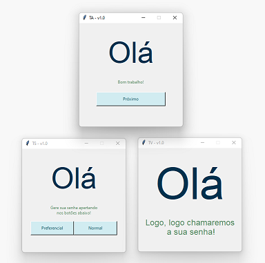
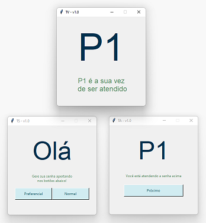

# queue-manager

Gerenciador de filas e senhas de atendimento

<p float="left">
   
  
</p>


#### Como Rodar o Server

Para rodar o servidor será necessário ter o python instalado e a porta `50000` disponível. Uma vez que este esteja instalado, na pasta do projeto rode o comando a seguir:
```zsh
python runserver.py
```

e logo seu server iniciará.

#### Como rodar o TSClient

Para rodar o TSClient, também será necessário ter o python instalado. Inicialmente, roda o servidor. Uma vez que o servidor esteja `on`, abra um novo terminal e rode o comando a seguir:
```
python runclient_ts.py
```

Logo um janela abrirá com um `Client` do estilo `TS`. Note que toda vez que você precisar rodar um novo `client`, terá que abrir um novo terminal se quiser manter o anterior rodando.

#### Como rodar o TAClient

Para rodar o TAClient, também será necessário ter o python instalado. Inicialmente, roda o servidor. Uma vez que o servidor esteja `on`, abra um novo terminal e rode o comando a seguir:
```
python runclient_ta.py
```

Logo um janela abrirá com um `Client` do estilo `TA`.

#### Como rodar o TVClient

Para rodar o TVClient, também será necessário ter o python instalado. Inicialmente, roda o servidor. Uma vez que o servidor esteja `on`, abra um novo terminal e rode o comando a seguir:
```
python runclient_tv.py
```

Logo um janela abrirá com um `Client` do estilo `TV`.

